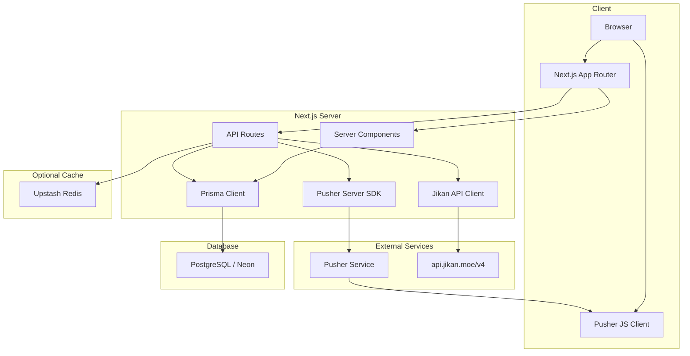

# Design Document — OXNIME Anime Streaming Platform

## Overview

OXNIME adalah platform streaming anime berbasis Next.js 16 yang dibangun di atas codebase yang sudah ada. Design ini mencakup 10 fitur utama: Jikan API sync service, Prisma schema update, halaman utama dinamis, halaman browse/katalog, search dengan debounce, halaman detail anime, video player dengan iframe embed, realtime via Pusher (live viewer count + komentar), bookmark/watchlist, dan API routes pendukung.

### Keputusan Arsitektur Kritis

**Menghapus `output: 'export'` dari `next.config.ts`**

`next.config.ts` saat ini menggunakan `output: 'export'` (static export mode). Mode ini **tidak kompatibel** dengan fitur-fitur yang akan dibangun karena:
- API Routes tidak bisa berjalan di static export
- Server Components dengan data fetching dinamis tidak didukung
- Middleware (`withAuth`) tidak berfungsi di static export

`output: 'export'` harus dihapus agar Next.js berjalan dalam mode server-side (default). Deployment target berubah dari static hosting ke platform yang mendukung Node.js server (Vercel, Railway, dll).

**Pusher sebagai Realtime Layer**

Socket.io sudah ada di codebase (`src/lib/socket.ts`, `server.js`) tapi tidak kompatibel dengan serverless deployment. Pusher dipilih sebagai solusi realtime karena sudah ada setup client-side dan kompatibel dengan Next.js API routes.

**Next.js 16 Async Params**

Berdasarkan pola yang sudah ada di `src/app/api/anime/[id]/episodes/route.ts`, params di route handlers dan page components adalah `Promise` yang harus di-`await`. Semua komponen baru harus mengikuti pola ini.

---

## Architecture



### Data Flow Utama

1. **Sync Flow**: `POST /api/admin/sync` → `JikanSyncService` → Jikan API → upsert ke PostgreSQL
2. **Browse/Search Flow**: Browser → API Route → Prisma query → JSON response
3. **Watch Flow**: Server Component fetch episode dari DB → render iframe embed
4. **Realtime Flow**: User action → `POST /api/pusher/*` → Pusher trigger → broadcast ke semua subscriber

---

## Components and Interfaces

### 1. Jikan Sync Service (`src/lib/jikan-sync.ts`)

```typescript
interface JikanAnimeResponse {
  mal_id: number;
  title: string;
  images: { jpg: { image_url: string; large_image_url: string } };
  score: number | null;
  year: number | null;
  episodes: number | null;
  duration: string | null;
  status: string;
  studios: Array<{ name: string }>;
  synopsis: string | null;
  genres: Array<{ name: string }>;
  type: string | null;
}

interface SyncResult {
  synced: number;
  errors: number;
  total: number;
}

// Fungsi utama
async function syncTopAnime(): Promise<SyncResult>
async function syncSeasonalAnime(): Promise<SyncResult>
async function syncAll(): Promise<SyncResult>

// Helper
function mapJikanToAnime(data: JikanAnimeResponse): Prisma.AnimeUpsertArgs['create']
async function delay(ms: number): Promise<void>
```

**Rate Limit Strategy**: Delay 400ms antar request normal, 1000ms saat menerima HTTP 429.

### 2. API Routes

| Route | Method | Handler | Deskripsi |
|-------|--------|---------|-----------|
| `/api/admin/sync` | POST | `syncAll()` | Trigger full sync dari Jikan API |
| `/api/anime` | GET | Prisma query | List anime dengan filter + pagination |
| `/api/anime/search` | GET | Prisma `contains` | Search by title, max 10 hasil |
| `/api/anime/[id]` | GET | Prisma `findUnique` | Detail anime by ID |
| `/api/anime/[id]/episodes` | GET | Prisma `findMany` | Episode list (sudah ada, perlu update) |
| `/api/bookmarks` | GET/POST | Prisma upsert/delete | Toggle bookmark |
| `/api/comments` | GET/POST | Prisma + Pusher | Komentar episode |
| `/api/comments/realtime` | POST | Pusher trigger | Broadcast komentar baru |
| `/api/pusher/presence` | POST | Pusher trigger | Join/leave viewer count |

### 3. Page Components

**Server Components** (data fetching langsung via Prisma):
- `src/app/page.tsx` — Home page, 4 seksi dari DB
- `src/app/anime/[id]/page.tsx` — Detail anime + episode list
- `src/app/watchlist/page.tsx` — Daftar bookmark user

**Client Components** (interaktivitas):
- `src/app/browse/page.tsx` — Filter state, pagination (bisa hybrid: Server Component dengan Client filter)
- `src/app/watch/[animeId]/[episodeId]/watch-client.tsx` — Video player + Pusher realtime
- `src/components/navbar.tsx` — Search dengan debounce (sudah ada, perlu update)
- `src/components/bookmark-button.tsx` — Toggle bookmark (baru)

### 4. Pusher Integration (`src/lib/pusher.ts`)

```typescript
// Server-side Pusher instance
import Pusher from 'pusher';

export const pusherServer = new Pusher({
  appId: process.env.PUSHER_APP_ID!,
  key: process.env.NEXT_PUBLIC_PUSHER_KEY!,
  secret: process.env.PUSHER_SECRET!,
  cluster: process.env.NEXT_PUBLIC_PUSHER_CLUSTER!,
  useTLS: true,
});

// Channel naming convention
// episode-{animeId}-{episodeNumber}

// Events
// viewer-count: { count: number }
// new-comment: { id, content, username, createdAt, likes }
// user-typing: { username: string }
```

---

## Data Models

### Perubahan Prisma Schema

Tambah field `malId` ke model `Anime`:

```prisma
model Anime {
  // ... field yang sudah ada ...
  malId       Int?      @unique  // MyAnimeList ID dari Jikan API
  
  // Index baru
  @@index([malId])
  @@index([featured])
  @@index([type])
  @@index([year])
  @@index([rating])
}
```

Field `malId` bersifat optional (`Int?`) agar anime yang diinput manual (bukan dari Jikan) tetap valid. `@unique` memastikan tidak ada duplikat dari Jikan API.

### Query Patterns

**Home Page — Trending:**
```typescript
prisma.anime.findMany({
  where: { trending: true },
  orderBy: { views: 'desc' },
  take: 12,
  select: { id: true, title: true, image: true, rating: true, episodes: true, type: true, status: true }
})
```

**Browse dengan Filter:**
```typescript
prisma.anime.findMany({
  where: {
    ...(genre && { genres: { has: genre } }),
    ...(status && { status }),
    ...(type && { type }),
    ...(year && { year: parseInt(year) }),
    ...(q && { title: { contains: q, mode: 'insensitive' } }),
  },
  orderBy: { rating: 'desc' },
  skip: (page - 1) * 20,
  take: 20,
})
```

**Search:**
```typescript
prisma.anime.findMany({
  where: { title: { contains: q, mode: 'insensitive' } },
  take: 10,
  select: { id: true, title: true, image: true, type: true, year: true }
})
```

### Environment Variables yang Dibutuhkan

```env
DATABASE_URL=
NEXTAUTH_SECRET=
NEXTAUTH_URL=
PUSHER_APP_ID=
NEXT_PUBLIC_PUSHER_KEY=
NEXT_PUBLIC_PUSHER_CLUSTER=
PUSHER_SECRET=
UPSTASH_REDIS_REST_URL=    # opsional
UPSTASH_REDIS_REST_TOKEN=  # opsional
```

---

## Correctness Properties

*A property is a characteristic or behavior that should hold true across all valid executions of a system — essentially, a formal statement about what the system should do. Properties serve as the bridge between human-readable specifications and machine-verifiable correctness guarantees.*

### Property 1: Jikan API Response Mapping Completeness

*For any* valid Jikan API anime response object, the `mapJikanToAnime` function SHALL produce an Anime record that contains all required fields: `malId`, `title`, `image`, `rating`, `year`, `episodes`, `status`, `description`, `genres`, `type`.

**Validates: Requirements 1.2, 1.4**

---

### Property 2: Sync Upsert Idempotence

*For any* anime with a given `malId`, calling the sync function twice with the same data SHALL result in exactly one Anime record in the database — no duplicates created.

**Validates: Requirements 1.3**

---

### Property 3: Sync Error Resilience

*For any* list of anime to sync where one or more items fail (network error, invalid data), the sync service SHALL continue processing the remaining items and the returned `SyncResult.synced` count SHALL equal the number of successfully processed items.

**Validates: Requirements 1.6, 1.8**

---

### Property 4: Browse Filter Correctness

*For any* combination of active filters (genre, status, type, year), every anime returned by `GET /api/anime` SHALL satisfy ALL active filter conditions simultaneously — no result may violate any active filter.

**Validates: Requirements 2.3, 2.4, 2.5, 2.6, 2.7**

---

### Property 5: Search Case-Insensitivity and Result Bound

*For any* search query string `q`, searching with `q`, `q.toUpperCase()`, and `q.toLowerCase()` SHALL return identical result sets, and the result count SHALL never exceed 10.

**Validates: Requirements 3.3, 3.4**

---

### Property 6: Search Debounce — Single API Call Per Window

*For any* sequence of keystrokes typed within the debounce window (500ms), the search API SHALL be called at most once — only after the user stops typing.

**Validates: Requirements 3.2**

---

### Property 7: Anime Detail Rendering Completeness

*For any* valid Anime record from the database, the detail page render SHALL include all required fields: title, cover image, rating, year, episode count, duration, status, studio, description, genres, and type.

**Validates: Requirements 4.2**

---

### Property 8: Episode List Ordering Invariant

*For any* set of episodes belonging to an anime, the episode list displayed on the detail page SHALL always be sorted in ascending order by episode number — no episode shall appear before an episode with a smaller number.

**Validates: Requirements 4.3**

---

### Property 9: Video Player URL Binding

*For any* Episode record where `videoUrl` is a non-null, non-empty string, the rendered video player iframe `src` attribute SHALL equal that `videoUrl` exactly.

**Validates: Requirements 5.2**

---

### Property 10: Episode Navigation Correctness

*For any* episode number `N` where `N > 1`, the "previous episode" navigation SHALL lead to episode `N-1`. *For any* episode number `N` where `N < totalEpisodes`, the "next episode" navigation SHALL lead to episode `N+1`.

**Validates: Requirements 5.4, 5.5**

---

### Property 11: Watch History Persistence

*For any* authenticated user watching episode `E` of anime `A`, after the watch event is recorded, a `WatchHistory` record SHALL exist in the database with the correct `userId`, `animeId`, and `episodeId`.

**Validates: Requirements 5.9**

---

### Property 12: Comment Persistence

*For any* comment submitted by an authenticated user with `content`, `userId`, `animeId`, and `episodeId`, after the POST request succeeds, a `Comment` record SHALL exist in the database containing those exact values.

**Validates: Requirements 7.2**

---

### Property 13: Comment Load Bound

*For any* episode with any number of comments in the database, the initial comment load via `GET /api/comments?episodeId={id}` SHALL return at most 50 comments.

**Validates: Requirements 7.9**

---

### Property 14: Comment Like Increment

*For any* Comment record with `likes = N`, after a successful like action, the `likes` field SHALL equal `N + 1`.

**Validates: Requirements 7.10**

---

### Property 15: Bookmark Toggle Idempotence

*For any* `(userId, animeId)` pair:
- After one bookmark action, exactly one `Bookmark` record SHALL exist.
- After a second bookmark action (toggle off), zero `Bookmark` records SHALL exist for that pair.

**Validates: Requirements 8.2, 8.4**

---

### Property 16: Watchlist Data Completeness

*For any* set of anime bookmarked by a user, the `/watchlist` page SHALL display each bookmarked anime with its current `status` and `episodes` count from the database.

**Validates: Requirements 8.9**

---

### Property 17: Home Page Section Ordering Invariants

*For any* database state:
- The "Trending Now" section SHALL display only anime where `trending = true`, ordered by `views` descending.
- The "Latest Episodes" section SHALL display anime ordered by `updatedAt` descending.
- The "Popular Anime" section SHALL display anime ordered by `rating` descending.
- The "Anime Movies" section SHALL display only anime where `type = "Movie"`.

**Validates: Requirements 10.2, 10.3, 10.4, 10.5**

---

### Property 18: LiveViewer State Consistency

*For any* join action with `(socketId, animeId, episodeId)`, a `LiveViewer` record SHALL be created. *For any* leave action with the same `socketId`, the corresponding `LiveViewer` record SHALL be removed.

**Validates: Requirements 6.6**

---

## Error Handling

### Jikan API Errors

| Kondisi | Handling |
|---------|----------|
| HTTP 429 (Rate Limit) | Tunggu 1000ms, retry request yang sama |
| HTTP 5xx (Server Error) | Log error, skip item, lanjut ke item berikutnya |
| Network timeout | Log error, skip item, lanjut ke item berikutnya |
| Field null/undefined | Gunakan nilai default (rating: 0, year: 0, dll) |

```typescript
// Pattern retry dengan exponential backoff untuk 429
async function fetchWithRateLimit(url: string): Promise<Response> {
  const res = await fetch(url);
  if (res.status === 429) {
    await delay(1000);
    return fetch(url); // single retry
  }
  return res;
}
```

### API Route Errors

Semua API routes menggunakan pattern:
```typescript
try {
  // logic
  return NextResponse.json(data);
} catch (error) {
  console.error('[route-name]', error);
  return NextResponse.json({ error: 'Internal server error' }, { status: 500 });
}
```

Error spesifik:
- **404**: Anime/episode tidak ditemukan → `{ error: 'Not found' }` dengan status 404
- **401**: Aksi yang membutuhkan auth tanpa session → `{ error: 'Unauthorized' }` dengan status 401
- **400**: Request body tidak valid → `{ error: 'Bad request' }` dengan status 400

### Pusher Connection Errors

Client-side Pusher menggunakan event `pusher:connection_error` dan `pusher:disconnected` untuk menampilkan indikator offline dan trigger reconnect otomatis (Pusher JS SDK sudah handle reconnect secara built-in).

### Database Errors

- Prisma `P2002` (unique constraint violation) → ditangani sebagai upsert, bukan error
- Prisma `P2025` (record not found) → return 404
- Connection errors → return 500 dengan log

---

## Testing Strategy

### Unit Tests

Fokus pada fungsi-fungsi pure yang dapat ditest secara terisolasi:

- `mapJikanToAnime(data)` — mapping function dari Jikan response ke Anime model
- Filter query builder — fungsi yang membangun Prisma `where` clause dari query params
- Debounce utility — fungsi debounce yang digunakan di search navbar
- Episode navigation logic — fungsi prev/next episode number calculation

Tools: **Jest** + **ts-jest** untuk TypeScript support.

### Property-Based Tests

PBT diterapkan untuk memverifikasi properti universal yang harus berlaku untuk semua input valid. Library yang digunakan: **fast-check** (TypeScript-native, tidak perlu setup tambahan).

Konfigurasi minimum: **100 iterasi per property test**.

Tag format: `// Feature: anime-streaming-platform, Property {N}: {property_text}`

Property tests yang akan diimplementasikan (berdasarkan Correctness Properties di atas):

| Property | Test File | fast-check Arbitraries |
|----------|-----------|----------------------|
| P1: Mapping Completeness | `__tests__/jikan-sync.test.ts` | `fc.record({ mal_id: fc.integer(), title: fc.string(), ... })` |
| P2: Upsert Idempotence | `__tests__/jikan-sync.test.ts` | `fc.integer()` (malId) |
| P3: Sync Error Resilience | `__tests__/jikan-sync.test.ts` | `fc.array(fc.record(...))` |
| P4: Browse Filter Correctness | `__tests__/api-anime.test.ts` | `fc.record({ genre, status, type, year })` |
| P5: Search Case-Insensitivity + Bound | `__tests__/api-search.test.ts` | `fc.string()` |
| P6: Debounce Single Call | `__tests__/debounce.test.ts` | `fc.array(fc.string(), { minLength: 2 })` |
| P7: Detail Rendering Completeness | `__tests__/anime-detail.test.ts` | `fc.record({ title, image, rating, ... })` |
| P8: Episode Ordering | `__tests__/episode-list.test.ts` | `fc.array(fc.record({ number: fc.integer() }))` |
| P9: Video URL Binding | `__tests__/video-player.test.ts` | `fc.webUrl()` |
| P10: Navigation Correctness | `__tests__/episode-nav.test.ts` | `fc.integer({ min: 1 })` |
| P11: Watch History Persistence | `__tests__/watch-history.test.ts` | `fc.record({ userId, animeId, episodeId })` |
| P12: Comment Persistence | `__tests__/comments.test.ts` | `fc.record({ content: fc.string(), ... })` |
| P13: Comment Load Bound | `__tests__/comments.test.ts` | `fc.integer({ min: 51 })` (jumlah komentar) |
| P14: Like Increment | `__tests__/comments.test.ts` | `fc.integer({ min: 0 })` (initial likes) |
| P15: Bookmark Toggle | `__tests__/bookmarks.test.ts` | `fc.record({ userId, animeId })` |
| P16: Watchlist Completeness | `__tests__/watchlist.test.ts` | `fc.array(fc.record({ status, episodes }))` |
| P17: Home Section Ordering | `__tests__/home-page.test.ts` | `fc.array(fc.record({ trending, views, rating, type }))` |
| P18: LiveViewer Consistency | `__tests__/live-viewer.test.ts` | `fc.record({ socketId, animeId, episodeId })` |

### Integration Tests

Untuk fitur yang melibatkan external services (Pusher, Jikan API):

- Pusher trigger dipanggil dengan channel dan event yang benar (mock Pusher SDK)
- Jikan API endpoint dipanggil dengan URL yang benar (mock `fetch`)
- Middleware auth redirect berfungsi untuk route yang dilindungi

### End-to-End Tests (Manual / Playwright — opsional)

- Full sync flow: trigger sync → verifikasi data muncul di home page
- Browse + filter: pilih genre → verifikasi semua hasil sesuai genre
- Watch flow: buka episode → verifikasi iframe muncul → verifikasi viewer count bertambah
- Comment flow: kirim komentar → verifikasi muncul realtime di tab lain
